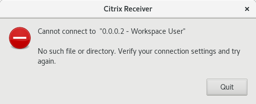

# Installing Citrix Receiver on Linux

In order to access the UKHO Citrix desktop, your computer needs to have Citrix Receiver installed.  On Windows, this is a straightforward, automatic process.  On Linux, it may require a manual install and some configuration. If you get this error, then follow the instructions on this page.




## Download and install Citrix Receiver

- Open a browser and navigate to the [Citrix Receiver for Linux download page](https://www.citrix.com/en-gb/downloads/citrix-receiver/linux/receiver-for-linux-latest.html)
- Navigate to the bottom of the page and download the relevant option from Debian Packages or RedHat packages. Both Web client and Full client seem to work
- Use your package manager (apt/yum/dnf) to install the downloaded package
- In the instructions below, the install location is referred to as $CITRIX_HOME.  Normally this will be ```/opt/Citrix/ICAClient``` but YMMV

## Configure certificates

For some reason, Citrix Receiver for Linux does not work out of the box on Linux.  This appears to be down to not shipping with the correct certificates.  The steps below describe how to correct this for Ubuntu and other distros. Be warned, however, that the instructions for all distros may require access to a working Ubuntu install.

### Ubuntu

These instructions were taken from [from this AskUbuntu post](https://askubuntu.com/questions/901448/citrix-receiver-error-1000119)

In short, telling Citrix Receiver to use the default CA certificates that ship with Ubuntu works just fine.

```sh
cd $CITRIX_HOME/keystore
sudo mv cacerts cacerts.original
sudo ln -s /etc/ssl/certs cacerts
cd util
sudo ./ctx_rehash
```

### Fedora 

Unfortunately the default certificates that ship with Fedora are not sufficient. These are stored in ```/etc/pki/ca-trust/extracted/pem``` and the instructions above do not work for the certificates in this directory. So, it is necessary to grab the certificates from a working Ubuntu install and manually paste them into your Fedora installation.  If you don't have access to a Ubuntu install, find someone that does and ask them nicely to follow the first set of instructions below.

#### Get the certificates from an Ubuntu install

Log into the Ubuntu machine then

```sh
cd /etc/ssl/certs
rsync -av --copy-links . ~/cacerts
cd ~/cacerts
tar cvzf ../cacerts.tar.gz .
```

This will create a file called ```cacerts.tar.gz``` in the home directory on the Ubuntu machine.  This file needs to be transferred to the home directory on the Fedora machine via sftp or other means.

#### Install the certificates on the Fedora machine

```sh
cd $CITRIX_HOME/keystore
sudo mv cacerts cacerts.original
sudo mkdir cacerts
cd cacerts
tar xf ~/cacerts.tar.gz
cd ../util
sudo ./ctx_rehash
```

Et voilà

## TODO 

It is unlikely that all of the certificates from the Ubuntu distro are required to make Citrix Receiver work.  It would be useful to identify the one(s) that are necessary and revise the instructions to address that certificate alone.
