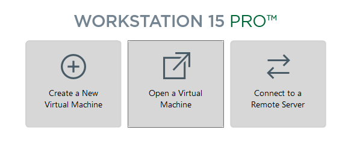
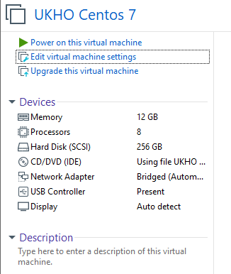
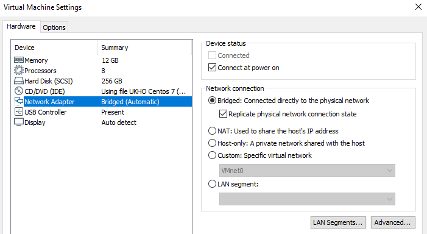
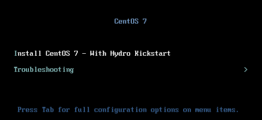
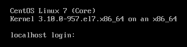
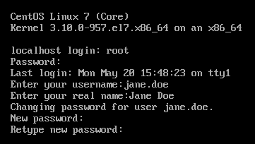
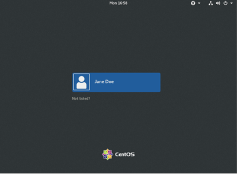
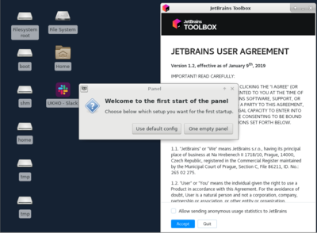
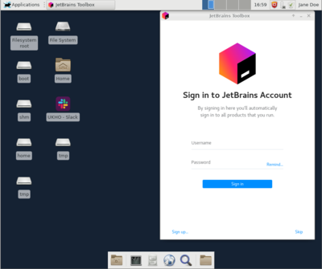

# Introduction 

This page attempts to outline how you can set up your linux workstation VM to run under VMWare Player Pro V15.0.2 or greater.

## Obtaining VMWare player 

If your laptop doesn't have VMware player installed, in the first instance open Software center from the start menu and see if it is available. If it is, install it from here. If it is not available for you in Software Center, speak to service desk (or ideally Matt Page, as he managed this rollout originally) to have this added to your software center.

## Obtaining the VM image 

<u>The first step of the process is to access the image which is held on:</u>

<code>\\\\business.ukho.gov.uk\dfs\Prod_Prod\Mint\OVF Image</code>

<code>U:\Prod_Prod\Mint\OVF Image</code>

and copy this directory to your laptop.

<u>Once copied, start up VMware Player Pro and on the "Home Screen" select the option "Open a Virtual Machine":</u>

Please use the file browser displayed to select the location where the image was copied.

You will recieve a dialog referring to a mismatch of versions, this is a known bug in VMWare workstation, press Retry and the process will continue.

<u>You will be asked for a name and a storage path - please ensure that the name of the VM image is:</u>

* UKHO CentOS 7

<u>Please ensure that the storage path of the VM image is:</u>

* C:\VirtualMachines\DevVM

'''<u>NOTE:</u> It is important that the specified location is used for compliance with SyOps!'''

## Settings for the VM image 

<u>Ensure the 'tab' for the virtual machine in the UI is selected and click on the 'Edit Virtual Machine Settings' link on the left-hand-side of the page:</u>

In the window displayed, select the 'Network Adapter' entry on the left hand side.

<u>In the right hand side of the same window, ensure that the following settings are selected under "Network connection":</u>

* "Bridged" mode is selected

* Replicate physical network connection state is selected.

Click OK when done.

## Installation - Initial Packages 

Start-up the Virtual Machine by selecting the "Power On" (Ctrl+B) option.

<u>You will shortly see a screen having the option "Install Centos 7 - With Hydro Kickstart".  Press Enter to continue:</u>

You will then see a screen which displays "Press <Enter> to start the installation process" - either press Enter (or wait and the install should start automatically.

This starts the kickstart installation process.

<u>After some minutes (Approx. 7mins, Go grab a lengthy coffee/tea/soft drink) you should see the following:</u>

Press return.  You will get a message box stating that the machine has halted.

Select the "Restart Guest" option (or press Ctrl+R) on the VM power settings.

## Installation - Logging in the first time 
------------------------------------------------------------------------------------------------------
<b>IMPORTANT! Don't try this on UKHO_LAPTOPS wifi, as the setup will not be able to access GitHub</b>
------------------------------------------------------------------------------------------------------

<u>After a few minutes the VM should boot and you should be presented with a login prompt:</u>

<u>Enter the following:</u>

For username: <code>root</code>

For password: <See password in PMP under "Mint VMWare Dev Workstation Root">

<u>You will be asked for the username of the new user you wish to create on the VM, which should be:</u>

* Lower-case

* Alphabetic

* No spaces

* (E.g. joe.bloggs, jane.doe)

<u>Next, you will be asked for your full name, which should be:</u>
* Alphabetic

<u>Next, you will be asked for your password:</u>
* NOTE: There are restrictions on the password you can use; passwords which are too lenient will be rejected.

<u>The set of interactions (for a user named jane.doe) might look as follows:</u>

<u>The installation process will then continue, and you should see a login manager displayed after some time:</u>

<u>Press space, this will display a set of users you can log in as (initially, this is the user you created earlier):</u>

<u>Login by selecting the name of the user you entered earlier and enter the password, you should be presented with a screen as follows:</u>

Initially, this looks a little spartan!

<u>You can get an initial desktop created by selecting the 'Use Default Config' option - you should then see something as follows:</u>

# Installing development utils 

<u>Once you have logged in, if you wish to install maven, Java 8 Sdk and Yarn please go to a terminal and type:</u>

<code>cd ~/linux-workstation/ansible</code>

<code>sudo ansible-playbook -i inventories/laptop-vm/hosts --vault-password-file=$HOME/.config/linux-workstation/.vaultpass development.yml</code>

This should then install the basic utilities needed.

# Known Issues 

<u>Currently, the VPN on the Linux VM has an issue if you do the following:</u>

* Suspend the Linux VM when the laptop is connected to the network via USB-C

* Resume the Linux VM when the laptop is connected to the network via WiFi

Or:

* Suspend the Linux VM when the laptop is connected to the network via WiFi

* Resume the Linux VM when the laptop is connected to the network via USB-C

<b>Alternatively, keeping the VM un-suspended whilst changing networks avoids this scenario.</b>

The issue is that the VPN on the Linux VM never seems to be able to reconnect successfully - the best way around this is to reboot the VM.

