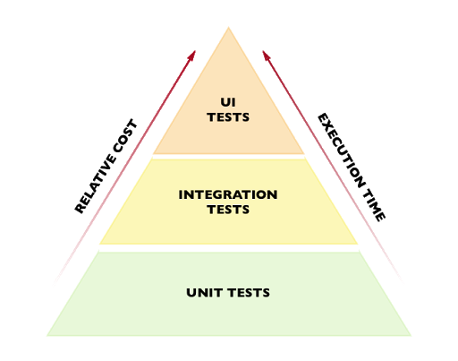

# Test Strategy

This strategy details how we add value through testing at the UKHO. Our teams adhere to this strategy when deciding their approach to testing, creating a Test Approach document for their current project.

> Always use automation first where possible

## Methods Of Testing

Some details about testing methods...

### Automated

stuff...

### Manual

stuff...

### Exploratory

* Exploratory testing should be used to verify quality in addition to regular manual and automated testing
* Sessions should be planned with a charter (including time-box, area to review, personas)

## Test Types

Some details about test types...

### Accessibility

Stuff...

### API Contract

* Contract testing should be considered when developing an API that will communicate with another UKHO API
* When interacting with the Data Platform this is mandatory
* [PACT](https://docs.pact.io/) is the technology to use
* Use the [UKHO PACT documentation](https://docs.data.ukho.gov.uk/testing/pact/introduction/) to learn how to do this

### Cross Browser

* The team should define the browser (and device if mobile testing is required) requirements. These should be documented in the Test Approach for that item of work.
* This requirement should be considered as early as possible by the team.
* Browser testing should be carried out on the latest version of Chrome as a minimum.
* If multiple browsers need to be tested then work closely with the Test Leads and Product Owner to ensure the correct approach is taken, more details can be found on the [Browser Automation](./browser-automation.md) page.

### Deployment

* The coverage for deployment verification will be defined in the Test Approach for that item of the work and is used as a quality gate to ensure the deployment has been successful
* This could include:
  * Pester tests to validate the environment is as expected
  * Smoke and Regression tests to ensure the product(s) are working as expected

### End To End

Stuff...

### Functional

Tests should be added at the correct level of the test pyramid – lower is better.

### Performance

Stuff...

### Production

Stuff...

### Safety

* Safety assurance is part of our core software engineering processes (ensuring our products are safe for the end user)
* We have adopted [BS EN 61508-3:2010](https://fdocuments.in/document/iec-61508-6.html) as our safety standard
* Safety is the responsibility of the whole team and is championed by the Test Engineer

### Security

* Testing to ensure security should take place throughout development
* The OWASP ZAP scanner should be used for development of APIs and UIs - see [UKHO OWASP Zap Scanner project](https://github.com/UKHO/owasp-zap-scan) for more information.

### User Acceptance

* Testing must recognise the importance of ensuring we are delivering value to users
* The team should involve users during the development process
