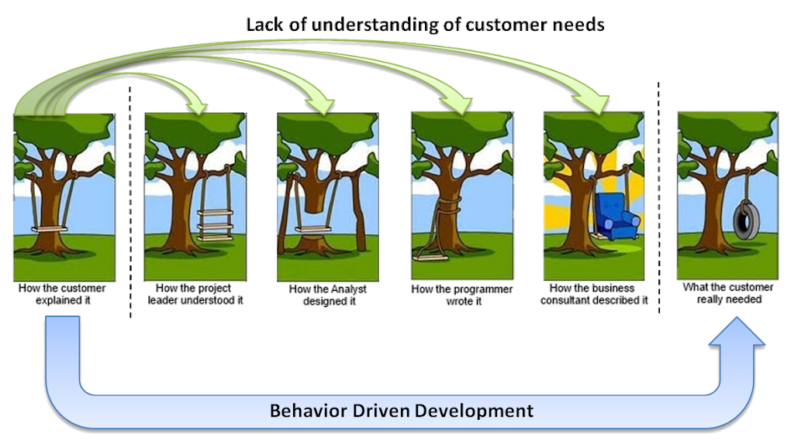
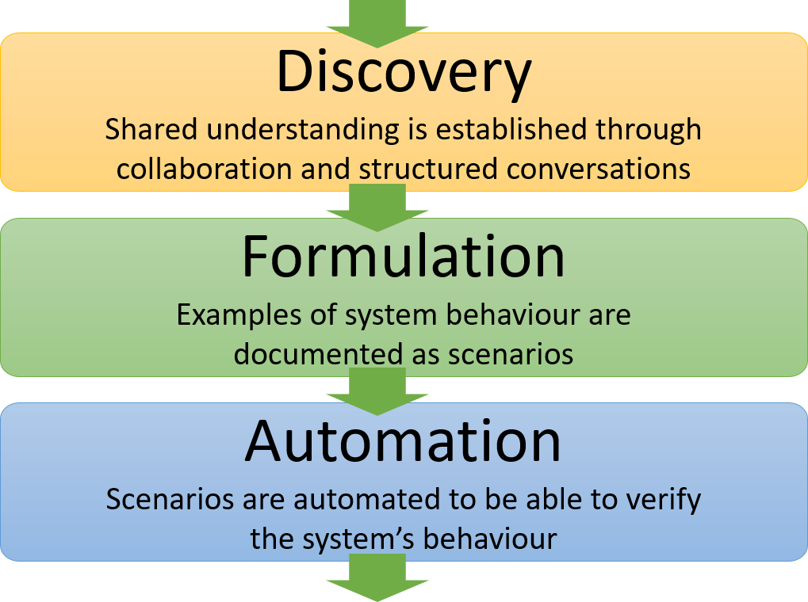
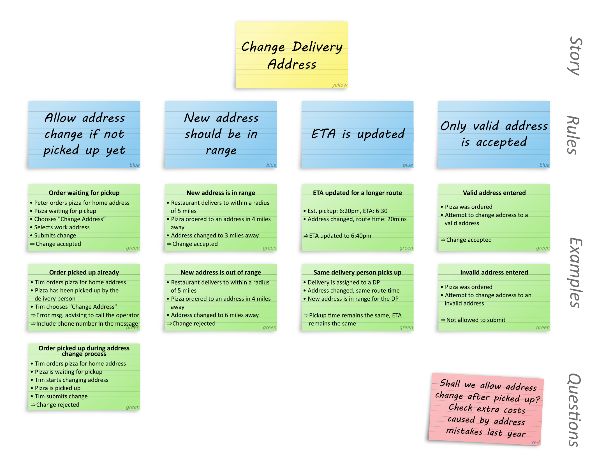

# Behaviour Driven Development (BDD)

## What is BDD

> "An approach that enhances communication between stakeholders and project team members by expressing product needs as concrete examples"

BDD:

* Is a **process** to enable the entire team to better understand stories before they are played
* Enables structured **collaboration** between Product Owners (proxy for the customer), developers and testers to gain an agreed understanding
* Uses **rules and examples** to illustrate this understanding

BDD is NOT:

* Testing
* Gherkin
* SpecFlow or Cucumber
* Just automated tests (tests are a downstream benefit)

## Benefits of BDD

* Creates a shared understanding in the team of user requirements
* Ensures all perspectives are considered when defining requirements
* Produces better software that matches user needs first time

## Stages of BDD

## How a team can apply BDD

### Discovery

* The customer representative brings requirements to the team as user stories (PBIs)
* The [Example Mapping technique](#example-mapping) is applied to these stories either by the whole team or a "Three Amigos" subset
* This will create rules and examples that illustrate an understanding of the story

### Formulation

* Examples can be formulated into Gherkin and documented in the [acceptance criteria](acceptance-criteria.md)
  
### Automation

* Derive automated tests from the Gherkin (this does not have to involve putting the Gherkin into SpecFlow/Cucumber)

## Example Mapping

Example Mapping is a structured technique to drive out understanding of user requirements.

Example Mapping sessions can involve the whole team, or just the "Three Amigos" (Developer, Tester, Product Owner). It is important that all perspectives in the team are involved.

### Approach

1. A story is created by the customer representative and presented to the group.
1. The group discuss the story and determine rules that clarify the purpose of the story.
1. Examples are created by the group to demonstrate the understanding of the rules.
1. When creating examples it may become clear that further rules are needed.
1. When there are lots of rules this may indicate the story is too big and should be split.
1. Any questions that cannot be answered in the session should be recorded and answered subsequently.
1. If there are lots of questions this may indicate the story is not understood and needs to go back to the customer.

## Resources

### Books

* Discovery: Explore behaviour using examples - Gáspár Nagy and Seb Rose
  ([Amazon link](https://www.amazon.co.uk/Discovery-Explore-behaviour-using-examples/dp/1983591254/ref=sr_1_2?keywords=bdd+discovery&qid=1572530563&s=books&sr=1-2))
* Formulation: Document examples with Given/When/Then - Seb Rose and Gáspár Nagy
  ([Amazon link](https://www.amazon.co.uk/gp/product/B093N4C2C2?ref_=dbs_m_mng_rwt_calw_tpbk_1&storeType=ebooks&qid=1572530563&sr=1-2))
* BDD in Action: Behaviour-driven development for the whole software lifecycle - John Ferguson Smart
  ([Amazon link](https://www.amazon.co.uk/BDD-Action-Behavior-driven-development-lifecycle/dp/161729165X/ref=sr_1_1?keywords=bdd&qid=1572530667&s=books&sr=1-1))

### Online resources

* [Example Mapping by Gáspár Nagy](http://gasparnagy.com/2019/05/divide-conquer-a-la-bdd-story-rule-scenario/)
* [Another description of Example Mapping by Matt Wynne](https://cucumber.io/blog/example-mapping-introduction/)
* [Writing better Gherkin scenarios](http://gasparnagy.com/2019/05/clean-up-bad-bdd-scenarios/?utm_source=BDD+Addicts+Newsletter&utm_campaign=d1bc786403-BDD_Addict_Newsletter_August_2019&utm_medium=email&utm_term=0_becf448392-d1bc786403-180800965)
* [Gherkin - keeping your scenarios BRIEF](https://cucumber.io/blog/keep-your-scenarios-brief/)
* [How writing good Gherkin enables better automation](http://angiejones.tech/writing-good-gherkin-enables-good-test-automation/?goal=0_02cca1920b-4b08e68d18-289488633&mc_cid=4b08e68d18&mc_eid=a98df43caa)
* [How to facilitate an Example Mapping session](http://gasparnagy.com/2019/04/example-mapping-the-good-enough-facilitator/?utm_source=BDD+Addicts+Newsletter&utm_campaign=1c0d110c08-BDD_Addict_Newsletter_August_2019_COPY_01&utm_medium=email&utm_term=0_becf448392-1c0d110c08-180800965)
