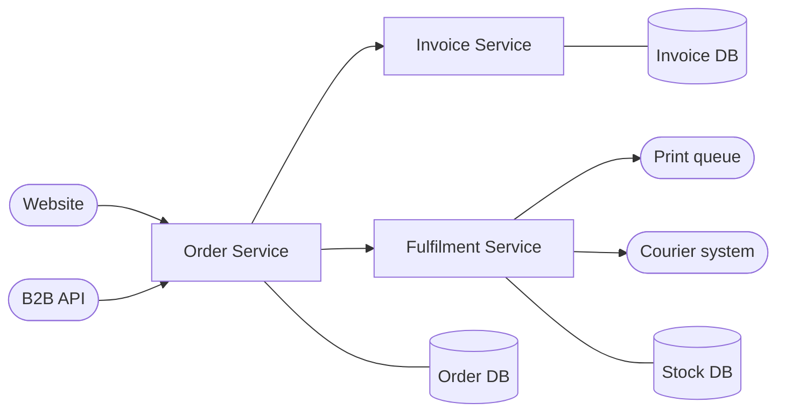

# Types of functional testing

This document describes types of functional test that are appropriate for microservice systems, and when they should be used.

## Example used in this document

The following example is used to illustrate each type of testing in this document.

A system is used to process product orders.  It contains the following services.

### Order Service

Accepts orders from a SPA webapp and from B2B service, via API calls.  It records the orders in a database, calls the invoice service and the fulfilment service.

### Invoice service

Creates an invoice record for a customer in a database.

### Fulfilment service

Creates a request to pack up an order and changes stock of the items.

- Sends a picking slip to warehouse printer queue
- Reduces the stock in the stock database
- Makes an external call to a courier company API to schedule for pick-up

## Unit tests

Unit testing of classes for the correctness of their function.  These will often not be directly mappable to business requirements.  Where they do relate directly to business requirements (e.g. business rules coded within a class), then these may take the place of other types of testing.

### When to use

Always.

## Service tests

These test the complete function of an individual service.  These will make up a large part of the testing effort for a system.  Test doubles are used to simulate interaction with other services. 

Service tests are ideally run in-process (i.e. not including any network calls).  This might involve calling the service on an internal interface, using an in-memory database etc.  

It might not be possible to test the service in-process, in which case out-of-process tests can be used.  Here, a service might be deployed, called over a network, and use resources that are also accessed out-of-process (e.g. a database accessed over a network).

A mixture of in-process and out-of-process tests will often be needed.

Service tests: 

- should fully test the business requirements of a service, including side-effects (e.g. persistence of data).
- should cover all of the published interface, including error scenarios
- may be expressed using gherkin syntax

Where unit tests clearly cover some of the functionality of a service, this need not be repeated in service tests, e.g. validation of API inputs may be covered by unit tests of validator classes.

### When to use

Always.

### Example

Service tests should be used to test the Fulfilment service.  It must test all business rules such as:

- if all items are in stock, it must send a picking list to the printer, reduce the stock in the database, schedule a courier pick-up for the end of the current day
- if any items are out of stock, it will store the information for later fulfilment and return the expected fulfilment dates
- if the fulfilment can be made it will return a 201 status code 
- if a product is no longer sold, it will return a 409 status code with information about the missing product in the response body. 
- Etc.

For these tests, in-process doubles are used to simulate the behaviour (including error conditions) of the printer and the courier system.  An in-memory database is used in place of the real stock database.  The service’s API is called in-process using the methods on the .Net controller class.

The validation of the API calls to the service (e.g. checking for missing fields) is performed by a validation rule class.  This class is unit tested, and these are not repeated in service tests.

## User interface tests

These are really a category of Service Tests, and the same principles apply.  They should only verify that a user interface works correctly.

It should only test that the correct elements are rendered, activated, deactivated etc. and that data is marshalled and unmarshalled correctly in calls to other services.  The UI should be tested in isolation and tests should use mocking techniques to simulate other services.

### When to use

Non-trivial UI behaviour should have automated UI tests.

### Example

The SPA webapp displays a shopping cart of products.  Tests check that once credit card details are entered, the ‘Buy now’ button is enabled.  Tests also check that on that button being pressed, the order details are correctly gathered into an API request to the Order Service.  They also check that the screen correctly displays the order number in the API response. 

## Contract tests

These verify that consumers and providers of an API act according to a shared understanding of it.  It only checks the behaviour in terms of the data passed each way in API calls.
i.e. Does each consumer correctly generate a request, and correctly handle the expected response AND does the real provider correctly handle such a request, and return the correct response.
Contract tests must never test the functionality of the consumers or producer.  This should be carried out in service tests or integration tests.

### When to use

Contract testing provides value when:

- There are plans for multiple users of a provider API
- The provider API is going to be under active development
- The same verification is not covered by integration tests

### Example

The Order service accepts orders from a customer website and from a B2B service.  

- The website expects to be able to submit products and their quantities and credit card details, and receive a response containing just expected delivery dates.  The contract test checks, for example, that the delivery dates are returned but not that they are accurate and reflect stock levels etc.
- The B2B service expects to be able to submit an account identifier instead of credit card details.  It also expects details of its updated credit line in the response.  The contract test checks that the credit line information is there in the response, but not that it is correct.

## Automated integration / system tests

These verify that multiple services work correctly together.

Typically, real services are deployed into a live-like environment.  Tests are run that require them to interact.  These tests may correspond to business requirements.  Test doubles (e.g. for external systems) may be used to allow the tests to be quicker and more reliable, or to generate certain scenarios.  However, integration tests should verify the system’s interactions with real direct dependencies such as storage, queues, databases, events etc.

Integration tests are slow to run and complex to create.  Only a very small amount of functionality should be tested with integration testing.

Integration tests should check authentication mechanisms and other aspects of interaction such as network configuration.

Integration tests might encompass a whole system (often known as 'end to end' tests at the UKHO).

### When to use

Sparingly.  This type of testing should check that services integrate together correctly, and data flows through the overall system correctly.  It should not attempt to provide significant coverage of functionality of individual services.

### Example

The Order, Invoice and Fulfilment APIs are deployed to test environment which resembles production.  Test doubles are used for the printer queue and the external courier API.
Orders are placed with the Order API, and the effect of this is verified: the invoice is created, messages are sent to the printer and to the courier system, appropriate database records are created, and the correct response is returned in the API call.

