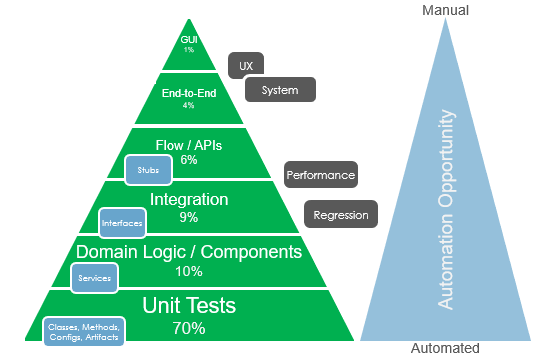

# Test Strategy

This strategy details how we add value through testing at the UKHO. Our teams adhere to this strategy when deciding their approach to testing, creating a Test Approach document for their current project.

Our core principles are:

* [Test early and Often by adopting a Shift Left test methodology](https://smartbear.com/learn/automated-testing/shifting-left-in-testing/)
* [Use automation whenever possible](./testing-principles.md#we-use-automation-whenever-possible)

## Methods Of Testing

This section will cover the three core methods of testing utilised at the UKHO with key points for each.

### Automated

Automation must be used when possible.

We suggest that all teams using automation should adhere to these principles:

* New functionality must be covered by passing automated tests (unless there is a legitimate reason not to).
* Make use of test design patterns and principles.
* Add tests at the correct level of the test pyramid – lower is better.
* All tests should be independent of each other.

### Manual Scripted

* Manual scripted testing should only be used when automation is not deemed the best approach (e.g. too costly, not feasible, not applicable).
* Tests will be created using appropriate test design techniques, e.g. risk based, decision tables, boundary values analysis.
* The team will decide on where these manual tests will be stored and maintained; Azure DevOps or feature files are two examples.

### Exploratory

* Exploratory testing should be used to verify quality in addition to regular automated and manual scripted testing.
* Sessions should be planned with a charter (including time-box, area to review, personas).

---

## Test Types

This section outlines the test types that need to be considered when preparing a Test Approach for a team's current project.

### Accessibility

* Testing to ensure the product(s) are accessible to those with disabilities, such as vision impairment, hearing disabilities, and other physical or cognitive conditions.
* Accessibility needs to be considered early and throughout the development process.
* More details can be found on our [accessibility testing](accessibility-testing.md) page.

### API Contract

* Contract testing should be considered when developing an API that will communicate with another UKHO API.
* When interacting with the Data Platform this is mandatory.
* [PACT](https://docs.pact.io/) is the technology to use.
* Use the [UKHO Data Platform PACT documentation](https://docs.data.ukho.gov.uk/testing/pact/introduction/) to learn how to do this.

### Cross Browser

* The team should define and document the browser (and device if mobile testing is required) requirements.
* This requirement should be considered as early as possible by the team.
* As a minimum, browser testing should be carried out on the latest version of Chrome.
* If multiple browsers need to be tested then work closely with the Test Leads and Product Owner to ensure the correct approach is taken.
* More details can be found on the [browser automation](browser-automation.md) page.

### Infrastructure 

* This could include the following, but is not limited to:
  * Unit and script validation
  * Integration 
  * End-to-End
  
### Mobile/Device

* This is to include
  * Operating systems
  * Manufacturer
  
### Deployment

* This could include:
  * Pester tests to validate the environment is as expected.
  * Smoke and/or regression tests to ensure the product(s) are working in the environment as expected.

### Disaster Recovery

The disaster recovery plan should be tested for a new or significantly changed system.  This will normally consist of a drill, whereby the disaster scenario(s) are simulated, and the written disaster recovery plan is followed.  This is to verify:

* the plan is complete and accurate, and following it leads to a fully recovered and functional system.
* the Recovery Time Objectives and Recovery Point Objectives are met by following the plan

### End-To-End

* Testing to ensure the application is performing as designed and expected from start to finish, simulating end user journeys.
* This should be used minimally and should predominantly cover happy path scenarios.

### Functional

The Functional Testing will be focused on the solution's functionality and business logic. The diagram is only to illustrate the type of tests 
you could consider, and the users in terms of Dev/Test/Users are only for illustration purposes and are not fixed.
The test pyramid indicates where the test effort should be focused in order to provide a better return and a faster feedback loop for failures and defects.
Tests should be added at the correct level of the test pyramid which directly influences the ROI eg the higher up the pyramid then the return on large number of tests start to deminish caompared to the effort needed to create and maintain them – lower is better. 

### Performance

* The purpose of performance testing is to determine how the product performs (stability and responsiveness) under specified conditions.
* The requirements for performance testing should be considered from the outset of the project and recorded as part of the Non-Functional Requirements.  
* [This checklist](performance-test-checklist.md) should be used to guide performance testing activities.

### Production

* Ensuring products delivered are up and behaving as expected is a key aspect of ongoing support and maintenance; this can be achieved via continuous testing and monitoring.

### Safety

* Safety assurance is part of our core software engineering processes (ensuring our products are safe for the end user).
* We are working to adopt [BS EN 61508-3:2010](https://fdocuments.in/document/iec-61508-6.html) as our safety standard.
* Safety is the responsibility of the whole team and is championed by the Test Engineer.
* More details can be found on on the [safety assurance](safety-assurance-guidance.md) page.

### Security

* Testing to ensure security should take place throughout development.
* A key output of the Threat Modelling process is Test Scenarios to confirm the identified vulnerability has not been exposed.

### User Acceptance

* The team should involve users throughout the development process to ensure the developed product satisfies their requirements.
