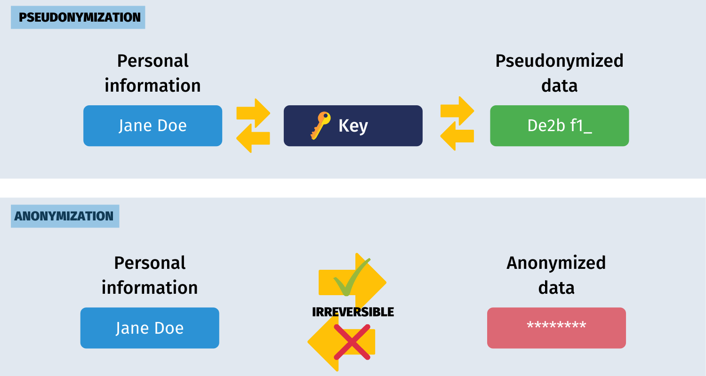

# Cloud Development Policy

## Purpose of this policy

The purpose of this policy is to establish guidelines and procedures for the appropriate and secure utilization of cloud resources in software engineering within the UK Hydrographic Office.

By leveraging cloud technologies, we aim to:

* Enhance the security posture of our organization by implementing robust controls and encryption mechanisms.
* Ensure compliance with relevant data protection laws, industry standards, and government regulations.
* Manage risks associated with cloud usage through proactive identification, assessment, and mitigation strategies.
* Optimize resource utilization and drive cost savings through efficient allocation and management of cloud resources.
* Facilitate scalability and flexibility to meet evolving business requirements and demands.

## Scope of this policy

This policy applies to all software engineering teams and individuals within the UK Hydrographic Office who are involved in the development, deployment, and maintenance of cloud-based applications and services.

## Revision History / Schedule

| Version | Date of Revision | Description of Change | Author | Approval Status |
| ------- | ----- | ----- | ----- | ----- |
| 0.1 | 07/11/2024 | Initial Draft | Cloud Guild | |

### Description of Changes

Version 0.1: Initial draft of Cloud Policy prepared by the Cloud Guild.

## Cloud First Approach

The Cloud First Approach is a strategic initiative aimed at prioritizing the adoption of cloud computing technologies in software engineering endeavors within the UK Hydrographic Office. This approach stems from the recognition of the transformative potential of cloud computing to enhance agility, innovation, and cost-effectiveness in delivering digital services.

### Guiding Principles

* Agility: Embrace cloud technologies to rapidly respond to changing business requirements and market dynamics.
* Security: Ensure the confidentiality, integrity, and availability of data and applications through robust security measures.
* Compliance: Adhere to relevant regulatory requirements and industry standards governing data privacy, security, and governance.
* Cost Optimization: Optimize cloud resources usage to maximize cost-effectiveness and operational efficiency.
* Innovation: Foster a culture of experimentation and innovation by leveraging cloud-native services and capabilities.

### Benefits and Challenges

A Cloud First Approach offers numerous benefits, including:

* Enhanced scalability and flexibility
* Faster time to market for software solutions
* Improved collaboration and productivity
* Cost savings through pay-as-you-go pricing models

It also presents challenges such as:

* Security and compliance concerns
* Operational complexity during migration and integration
* Potential vendor lock-in risks

## Acceptable Use for Cloud Technologies

The purpose of this section is to ensure that cloud resources are utilized in compliance with relevant laws, regulations, and organizational standards, while promoting efficiency, reliability, and data security.

## Network Security

### Guidance on Security with the Hub and Spoke Model. See [link](https://github.com/UKHO/how-do-i/blob/3373f41de95525cf795df0d9c1aae7ada2dcea86/docs/subscriptions.md?plain=1)

## Recommendations for Container Hosting / Orchestration (Rich Shawley)

### See Container Policy

### Never Run As Root

## Requirements and Recommendations for

### Auditing

### Testing - limit scope to infra testing ?? hand off to test community ?? - RS

### Virus Scanning

### Code Analysis

### Dependency Checking for Cloud Applications

### Infrastructure as Code - Terraform, etc

Terraform is UKHO's primary tool of choise for IaC and should be used for in all cases. Terraform provided multi-cloud provisioning and so is capable of deploying to any cloud provider.

#### Setting up a new project

The Terraform deployment template found here: https://github.com/UKHO/Terraform-Deployment-Template should be used to ensure consistency when starting up any new project. Contact the DDC team if you have any questions.

#### Networking

The DDC team are responsible for the creating and maintaining the networking spoke Terraform for each project. This is managed in a separate GitHub repository to the project terraform and can be found here: https://github.com/UKHO/Azure-Spokes

#### Modules

The DDC team manages a collection of centralised Terraform modules found here: https://github.com/orgs/UKHO/teams/tfmodules/repositories
These should be used whenever possible.

#### IaC Scanning (Trivy)

Trivy is UKHO's Chosen IaC Scanning tool. All Infrastructure pipelines should include a Trivy Scan stage before deployment that fails the build if misconfigurations or vulnerabilities are detected.
A Trivy Stage is included in the previously mentioned Terraform deployment template: https://github.com/UKHO/Terraform-Deployment-Template/blob/5ca2e1c18618dad0df84ef8c08aea87a64c3b94e/azure-pipelines.yml#L37

### Secrets Management

## Deployment

### Code Scanning

Before any code is pushed into an environment it should undergo our SAST checks from [Snyk](https://app.snyk.io/login) to try and ensure that the code we are creating is not going to leave us vulnerable. Any issues found that are high or above should be dealt with before doing any deployments to an environment. Where you feel there may be an exception to this, you can reach out the Security team or your Lead Developers for advice on mitigation/suppression of these issues.

### Container Scanning

Container images being produced for deployment into an environment should be scanned by a preferred scanning solution to ensure that we are not deploying vulnerable software. Details on our container policies can be found in the [Containers area.](/software-engineering-policies/Containers/) 

### Dependency Checking for Cloud Applications

It is important that we do not allow our dependencies to be the weak link in our security chain. Pipelines should use the preferred Software Composition Analysis (SCA) scanning tool that prevents any dependencies with high or above vulnerabilities to be released. Where you feel there may be an exception to this, you can reach out to our [ITSO team](mailto:ukho-itso@ukho.gov.uk) or your Lead Developers for advice on mitigation/suppression of these issues.

## Security

### Azure Advisor - Not MVP

## Data Use in the cloud (Dee)

### Statement on personal / sensitive data

Personal Identifiable Information (PII) should only be held in accordance with the Data Protection Act 2018.

PII should be minimised and/or anonymised in system logging. Where PII is required in logs, the PII should be pseudonymised.

### Data Protection Act and useful respources (Links)

* [An overview of the Data Protection Act 2018](https://ico.org.uk/media/for-organisations/documents/2614158/ico-introduction-to-the-data-protection-bill.pdf)
* [A guide to the data protection principles](https://ico.org.uk/for-organisations/uk-gdpr-guidance-and-resources/data-protection-principles/a-guide-to-the-data-protection-principles/)

### Georedundancy

Where possible, data should be georedundant. Some cloud services have this available out-of-the-box, such as Azure Storage Accounts, and others require setting up multiple resources and designating a primary and secondary.

### Data Sovereignty (UK datacentres only)

:thinking:

### Recommended / supported database solutions

WIP

* Support encypt at rest and transit

## Users

### User Management (Internal and External) - Rich to talk to Neena Brown about target IDAM architecture

WIP

* use federated accounts over local accounts in each tenant.
* use access packages where appropriate
* External users should have a sponsor from the internal and external domains.

### Entra ID accounts over SAS / access keys / username/password connection strings (Paul King)

WIP

* use RBAC over connection strings and local accounts
* For SQL: Disable SA accounts and/or SQL login (use Entra ID login only)

### Auth - Are there existing policies, should there be, who should own this (paul to chat/investigate with security guild)

## Disaster Recovery & Business Continuity

A business is as only as robust as its systems and services. Ensure you have a plan to restore your services in the event of a partial or complete failure. Don't wait for a crisis to occur. Instead, prepare ahead by planning and designing your services to be robust, and ensure you have structures in place to restore your services in the event of a failure. Recommended steps include:

* Know your business requirements and SLAs (Service Level Agreements). These will inform the approach taken to recovering after services fail.
* Understand the risks within your services, and their potential impacts. Consider and document options to mitigate those risks.
* Ensure you have systems in place for detecting outages, updating stakeholders and restoring services so you can
  * resolve outages quickly and efficiently,
  * recover from data loss or corruption
  * resume normal services
    * as fast as possible.
    * within the requirements of your SLAs

Training is available in Business Continuity planning. This should be completed by all members of the development team: See [link](https://learning.ukho.gov.uk/course/view.php?id=18)

### Building Robust Systems

* Where possible, use infrastructure as code tools, particularly Terraform (see Infrastructure as Code)
* Document infrastructure requirements, especially any secrets or manual steps that cannot or should not be recorded as infrastructure as code
* Consider using scaling, redundancy and load balancing solutions (such as those offered by Kubernetes) to mitigate the effects of single-service outages.
* Ensure that you have scheduled backups in place for all your data, supporting metadata and auditing solutions, and that these backups are sufficient to meet the terms of your SLAs
  * Scheduled backups should consider using GeoRedundant or Zone Redundant storage where possible (see Georedundancy above): this ensures that services can recover in the event of data loss affecting a single data centre
  * Data Sovereignty implications (See Data Sovereignty above) may mean that redundancy must be limited to the UK South and UK West data centres
* Set appropriate retention policies for historic data to ensure that that you can recover from partial or complete data corruption
* Ensure that backup and restore processes are thoroughly and unambiguously documented
* Agree and enforce secure policies for managing secrets within the team
* Consider using blue / green deployments, additional environments and other solutions to ensure redundancy and consistency between your services
* Consider employing external auditors to review your plans and recommend valuable improvements
* Perform regular testing and auditing to ensure the integrity of your data

### Disaster Recovery

* Complete and document a Disaster Recovery plan detailing how:
  * systems can be fully rebuilt from the ground up
    * following
      * a complete failure
      * a database service outage
      * a data corruption event
    * using
      * backups
      * infrastructure as code
      * documented manual steps
  * Ensure data and associated metadata can be recovered and restored from your regular backups
    * without data loss outside of agreed limits (usually a 2-hour time window)
    * within the timeframes allowed by your SLAs
    * without leaving data and supporting metadata out of sync
* Perform a disaster recovery exercise as early as possible to ensure that your processes work as intended
* Consider scheduling regular Disaster Recovery exercises:
  * to ensure necessary skills are maintained within the team
  * to ensure that documentation remains valid and up-to-date
  * and to maintain confidence in your recovery plan
* Consider using Azure Chaos studio to test common DR scenarios

## Logging and Monitoring for Cloud-Based Deployments

Appropriate logging, monitoring and auditing are essential to:

* Maintain confidence in your systems and services
* Provide early detection of outages and other issues affecting your services
* identify root causes in the event of outages, data loss, security concerns or other undesirable events

Logging Recommendations:

* Consider using the UKHOs centralised elasticsearch capability to ensure that all logs are captured and retained
* Agree on appropriate formats and logging levels to ensure logs are available and useful in maintaining your services
* Consider options to control log access and ensure logs are free from unnecessary sensitive data

Please view the [Software Engineering Team Logging Policy](https://github.com/UKHO/docs/blob/main/software-engineering-policies/Logging/LoggingPolicy.md) and the [UKHO's security-focused Logging and Monitoring Policy](https://ukho.sharepoint.com/sites/docstore-prd/_layouts/15/Doc.aspx?sourcedoc=%7B925F1410-7556-4B0E-8437-25497AED4562%7D&file=POL210.docx&action=default&mobileredirect=true&DefaultItemOpen=1) on SharePoint for further guidance on how and what to log.

Monitoring Recommendations

* Consider implementing Elastic Cloud APM to trace interactions across your services and identify performance issues or bottlenecks
  * Following recent budgeting and procurement activities, APM and ElasticSearch are now the UKHO standards for logging and observability
  * Consider using the EventHub logging Nuget package: UKHO.Logging.EventHubLogProvider
* Consider using correlation Ids to link related logs and events
* Consider whether dashboards can be utilised to give developers ongoing visibility of service health, usage and performance
* Consider whether automated alerts can be used to notify the development team of any outage or event
* Consider how to balance necessary alerts against unnecessary noise.
* Integrate solar winds for business central alerting

### On-prem vs DDC-managed vs In-team ELK/EFK stacks, etc

## Cloud Pilot's License

The UKHO Cloud Pilot's Licence is a new mandatory training module aimed at new starters or those moving into a development role, and is necessary to gain elevated access to UKHO cloud accounts. There are five areas of study and familiarisation:

* Azure Fundamentals
* UKHO Resource Naming Conventions
* UKHO Hub/Spoke Architecture
* UKHO Privileged Identity Management
* UKHO Cloud Security

For further details see the [UKHO Cloud Pilot's Licence](https://ukho.sharepoint.com/sites/SoftwareDevandTest/SitePages/Cloud-Pilot's-Licence.aspx) on Nautilus.

## Azure Policy for enforcement of configuration

## Tagging

Applied policies require the following tags on resources:

* SERVICE
* ENVIRONMENT
* COST_CENTRE
* SERVICE_OWNER
* RESPONSIBLE_TEAM
* CALLOUT_TEAM

Possible to use terraform `ignore_changes = [tags]` in which case tags will be inherited from resource hierarchy.

Should tags be deleted they will reapply with values from resource hierarchy.

Tag values can be changed and retained.

Tags should be kept current.

## Security Clearance

View Security Clearance policies [here]:(https://github.com/UKHO/docs-private/tree/main/software-engineering-policies/CloudDevelopment/Security%20Clearance)

## Related Information/Notes

### [Nautilus Account Types & Purposes](https://ukho.sharepoint.com/sites/SoftwareDevandTest/SitePages/Account-types.aspx)

### [Code Review Policy](https://github.com/UKHO/docs/blob/main/software-engineering-policies/CodeReview/CodeReviewPolicy.md)

### [Container Policy](https://github.com/UKHO/docs/blob/main/software-engineering-policies/Containers/ContainerPolicy.md)
