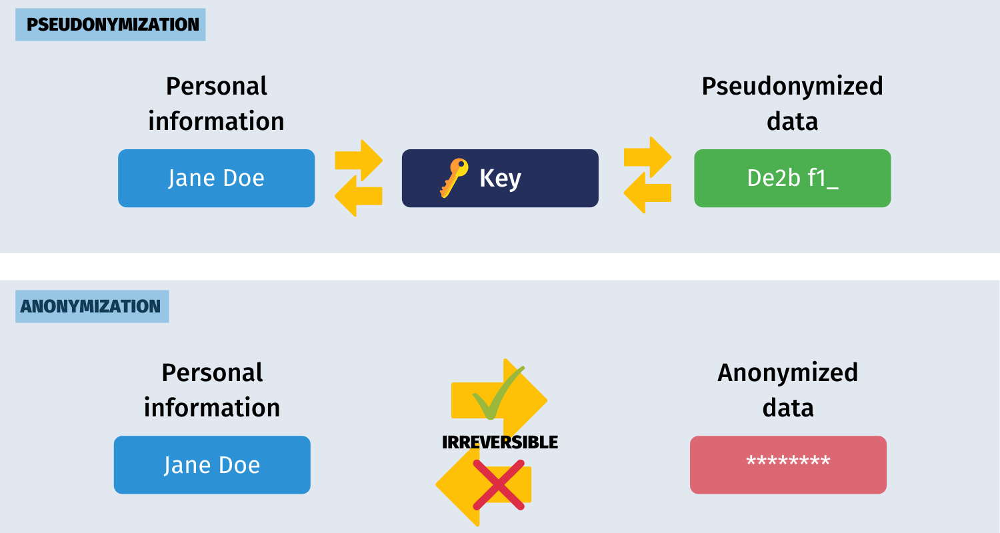

# Data Use in the cloud (Dee)

[Back to main Readme](README.md)

## Statement on personal / sensitive data

Personal Identifiable Information (PII) should only be held in accordance with the Data Protection Act 2018.

PII should be minimised and/or anonymised in system logging. Where PII is required in logs, the PII should be pseudonymised.

## Data Protection Act and useful respources (Links)

* [An overview of the Data Protection Act 2018](https://ico.org.uk/media/for-organisations/documents/2614158/ico-introduction-to-the-data-protection-bill.pdf)
* [A guide to the data protection principles](https://ico.org.uk/for-organisations/uk-gdpr-guidance-and-resources/data-protection-principles/a-guide-to-the-data-protection-principles/)

## Georedundancy

Where possible, data should be georedundant. Some cloud services have this available out-of-the-box, such as Azure Storage Accounts, and others require setting up multiple resources and designating a primary and secondary.

## Data Sovereignty (UK datacentres only)

For data that is potentially sensitive either from a legal, corporate or security perspective, data sovereignty must be considered, though it may be balanced against considerations of availability and business continuity. 

When you set up storage accounts and many other resources, Azure guarantees to store data within the selected region. Limiting data to UK datacentres will help to ensure legal and regulatory compliance, reduce risk of "jurisdictional overreach", maintain public trust and provide better performance and latency within the UK. Available regions are UK South and UK West. Even with Zone Redundant Storage, there is a small risk to availability if both UK regional datacentres were to fail at once, so for high availability of non-sensitive data, full georedundancy should be considered on a case-by-case basis.

> NB: These protections do not apply to all Azure resources, and particularly may not apply to global services such as Azure AD, Defender for Cloud, diagnostics and telemetry. There are services available to mitigate this concern by enabling data flow audits and mapping tools, but be wary, as these may come with a very high price tag.

Azure promises to maintain data access transparency, meaning they will:

* Never give governments access to your data without your knowledge (unless legally prohibited from doing so) 
* Challenge unlawful requests
* Disclose government requests in transparency reports

Azure complies with:

* [UK GDPR](https://www.legislation.gov.uk/eur/2016/679/contents) and EU GDPR
* ISO/IEC 27001, 27017, 27018
* NHS DSP Toolkit, UK Cyber Essentials Plus
* Financial regulations from the FCA, Bank of England, etc.

Microsoft is a US company, and is subject to laws such as the [US Cloud Act](https://www.congress.gov/bill/115th-congress/senate-bill/2383/text), which may conflict with these goals However, they have demonstrated a willingness to challenge requests that conflict with local laws as set out in their article on [Defending Your Data](https://blogs.microsoft.com/on-the-issues/2020/11/19/defending-your-data-edpb-gdpr/).

> Recommendation: Especially sensitive data that cannot be disclosed to foreign governments (including the US) should be kept on premises only. For anything else, favour UK Datacentres where possible. Exercise due diligence and always comply with GDPR rules whether data is stored at home or abroad.

> NB: Azure Government (US) or Azure Germany are specialised sovereign cloud environments, but there is currently no equivalent for the UK.

## Recommended / supported database solutions

At the UKHO, we should always choose solutions that support encryption at rest and in transit, whilst providing highly available, performant access to our data.

Currently, the UKHO recommends the following data management systems:

* Microsoft SQL Server
  * as a standard Relational Database Management Solution
* Cosmos DB 
  * for non-relational (document based) data

Both of these services are widely used, and offer a good range of modern features including encryption at rest and in transit.

Oracle DB is currently used by some teams in the UKHO, but is not specifically recommended. SQLite and PostgreSQL have also been used at the UKHO, but are currently not recommended for production systems.

The UKHO has a wide community of experienced software engineers using a range of database solutions. However, a good resource to consider when selecting a technology is the [UKHO Tech Radar](https://techradar.ukho.gov.uk/) which aims to track both which technologies are being adopted or abandoned, and where you might find expertise around specific technologies.

[Back to main Readme](README.md)
