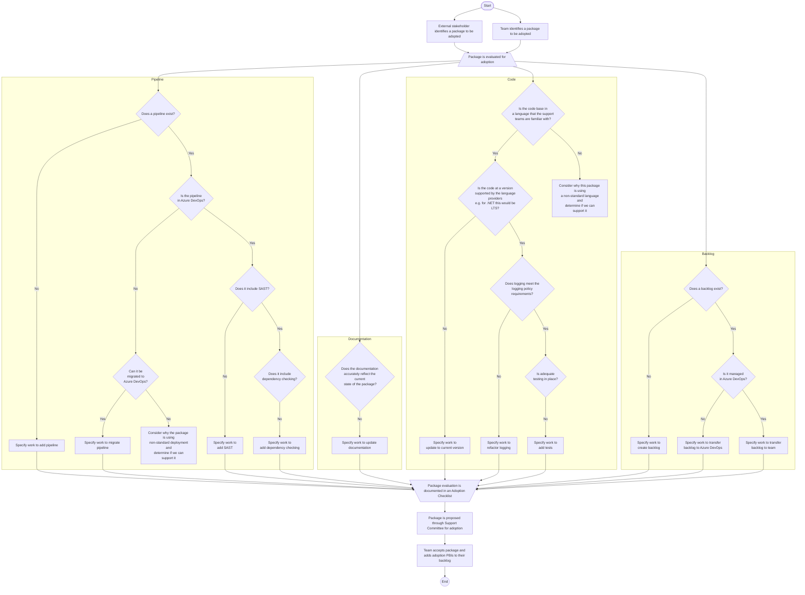

# Package Adoption Guidance

```mermaid
graph TD
    Start([Start]) --> I1[External stakeholder identifies a package to be adopted]
    Start --> I2[Team identifies a package to be adopted]
    I1 --> E1[/Package is evaluated for adoption\]
    I2 --> E1
    E1 --> P1
    E1 --> D1
    E1 --> C1
    E1 --> B1
    subgraph Pipeline
    P1{Does a pipeline exist?}
    P1 -->|Yes| P2{Is the pipeline</br> in Azure DevOps?}
    P2 -->|Yes| P3{Does it include SAST?}
    P3 -->|Yes| P4{Does it include</br> dependency checking?}
    P1 -->|No| P5[Specify work to add pipeline]
    P2 -->|No| P6{Can it be</br> migrated to</br> Azure DevOps?}
    P6 -->|Yes| P7[Specify work to migrate pipeline]
    P6 -->|No| P8[Consider why the package is using</br> non-standard deployment and</br> determine if we can support it]
    P3 -->|No| P9[Specify work to</br> add SAST]
    P4 -->|No| P10[Specify work to</br> add dependency checking]
    end
    subgraph Documentation
    D1{Does the documentation</br> accurately reflect the current</br> state of the package?}
    D1 -->|No| D2[Specify work to update documentation]
    end
    subgraph Code
    C1{Is the code base in</br> a language that the support</br> teams are familiar with?}
    C1 -->|Yes| C2{Is the code at a version</br> supported by the language providers</br> e.g. for .NET this would be LTS?}
    C2 -->|Yes| C3{Does logging meet the</br> logging policy requirements?}
    C3 -->|Yes| C4{Is adequate</br> testing in place?}
    C1 -->|No| C5[Consider why this package is using</br> a non-standard language and</br> determine if we can support it]
    C2 -->|No| C6[Specify work to</br> update to current version]
    C3 -->|No| C7[Specify work to</br> refactor logging]
    C4 -->|No| C8[Specify work to</br> add tests]
    end
    subgraph Backlog
    B1{Does a backlog exist?}
    B1 -->|Yes| B2{Is it managed</br> in Azure DevOps?}
    B2 -->|Yes| B5[Specify work to transfer</br> backlog to team]
    B1 -->|No| B3[Specify work to</br> create backlog]
    B2 -->|No| B4[Specify work to transfer</br> backlog to Azure DevOps]
    end
    E2[\Package evaluation is documented in an Adoption Checklist/]
    P5 --> E2
    P7 --> E2
    P9 --> E2
    P10 --> E2
    D2 --> E2
    C6 --> E2
    C7 --> E2
    C8 --> E2
    B3 --> E2
    B4 --> E2
    B5 --> E2
    E2 --> E3[Package is proposed through Support Committee for adoption]
    E3 --> E4[Team accepts package and adds adoption PBIs to their backlog]
    E4 --> End((End))
```
