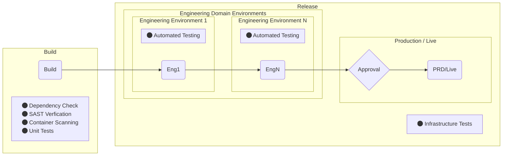
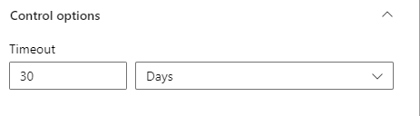

# UK Hydrographic Office Baseline Expectations

## Statement of Intent

A deployment/release pipeline for a UKHO digital product must, as a minimum, meet the following guidelines.

## Tooling

UKHO pipelines should be written as code, using YAML and syntax compatible with Azure Pipelines (Most Cloud or Hosted solutions) or GitHub workflows (packages, tools, etc.).

## Environments

The UKHO expects a release pipeline to include the following environments:

The UKHO considers a minimum of three identical environments standard practice;

- Development/engineering work
- Formal testing (whether that be automated, manual, exploratory or end-user)
- The live environment

This is not the specific requirement for every project but should be considered as the MINIMUM provisioning for any given digital product that the UKHO will support/develop. Legacy applications may be exempt from this statement but all current and future products should consider this a requirement.

## Variable Libraries

Where variable values do not need to be secret, they can be placed in an Azure DevOps variable library local to the project. No values in this variable library should ever be "padlocked" or marked as secret. Where secrets are required, they should be backed by an Azure key vault and linked through to the project as a separate variable library. Appropriate security measures should be taken to ensure that only the pipeline service principal and those who need to maintain the values have access to the key vault.

## Code Quality and Approvals

The UKHO expects each product to have the appropriate level of quality control in place for all of it's products. This will be dependant on the product requirements, but as a bare minimum there MUST be controls around what is committed to the `main` branch. Code deployed to production should only come from the `main` branch. Pull requests are expected to be reviewed (not by the creator of the PR) and completed before any code is merged to `main`. Further release approvals/controls are optional and open for discussion between team and product owner/manager.

Branch protection for main should be considered to avoid accidental or malicious commits to `main`. Consult [Branch Protection](BranchProtection.md) for further examples and detail.

### Pipeline Environment Approvals in Azure DevOps

When setting up checks and approvals on a Pipeline Environment; the default expiry is 30 days, this behaviour is queuing builds for days when they arent needed, in the scope of this a set of default values should be followed depending on the target environment.

| Environment | Timeout |
|-------------|---------|
| DEV | < 30 minutes |
| QA | < 3 hours |
| LIVE | < 6 hours |

To change these to something more suitable, you must expand on the **Control Options** when setting up the approval.

## Testing

The expectation is that code should be covered in full by suites of AUTOMATED tests (including unit, component, integration, ui and e2e). There should be no manual intervention needed within the pipeline to setup, run or clean up a test run. Manual testing should only be used when there is no alternative. See the [UKHO Test Strategy](https://docs.ukho.dev/quality-assurance/test-strategy/) for more details.

Legacy applications may well be exempt from this statement due to existing design/implementation technical debt but all new projects or products are expected to meet this requirement. Existing technical debt should be addressed promptly where possible to bring legacy applciations inline with this statement.

## Security Focus

Pipeline Threat Modelling should be carried out in all design, innovation and development work relating to pipelines, considering where threats may develop or emerge over time. Security is a vital aspect of how our pipelines should be designed and developed, the following approaches are detailed and should be considered per product pipeline:

### Must

- Dependency Checking - we recommend the OWASP dependency checker, other options are valid but consider impact on support and required knowledge for future changes.
- Static Application Security Testing (SAST) - Coverity is the current SAST offering, alternate options must be equivalent in provision.
- Secret values required by deployment must be backed by an Azure key vault

### Should - Added by UKHO

- Static Code Analysis (SCA) - Coverity contains the functionality to do this, future implementation examples to follow. Alternatives are available but should be justified (consider support and knowledge impact/requirement when using alternatives).
- Container Security Screening - Currently trialing Snyk and ECR (currently used by Data Science/Engineering) depending on technology stack.

### Could - Added by UKHO

- Software Composition Analysis - Coverity also has the ability to provide this.
- Dynamic Application Security Testing (DAST) - No set or experimental implementations currently, future research to follow.

## Working Principles

The release pipeline should be founded on the following principles:

- Automation - Pipelines should have as little manual input as possible throughout.
- Testing - Pipelines will contain a suite of automated tests that will fail the build if they fail.
- Security - Pipelines should be designed, innovated and developed with security at their core.
- Idempotency - The execution of a pipeline should be repeatable with an identical result each time.
- Source Control - Code MUST be handled using a form of source control and at the UKHO we currently use GitHub as our preferred provider.
- Loose Coupling/Microservices - Pipelines shouldn't rely on each other in order to complete successfully; each product/service should have it's own pipeline which can run in isolation.
- Infrastructure as Code - Infrastructure should be provisioned and configured as code; secure values required for this should be provisioned through secret management of some form.
- Branch Protection - the `main` branch should be protected from accidental or malicious commits via branch protection options.
