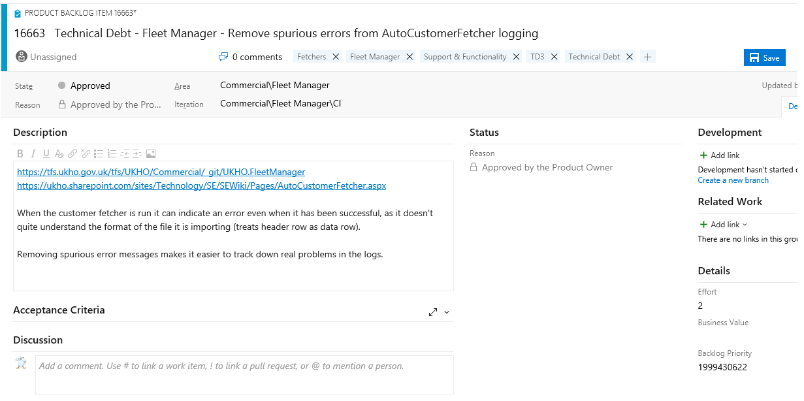

# Technical Debt Guidance

## Raising Technical Debt

Technical debt that will not be resolved in the sprint identified **MUST** be raised as a PBI in the relevant area of Azure DevOps or Azure DevOps Server. When raising Technical Debt, please add the following information to the Technical Debt PBI:

### Title

```Technical Debt - {Project} - {Concise outline of Technical Debt item} - {Date of failure if known}```

### Description

The description of the Technical Debt item must include the following as a minimum:

* The repository the Technical Debt lives within (a link to the repo would be good but the name would suffice)
* Description of the issue in as much detail as you can provide, including class/file names if this can be included
* A proposed solution or ideas for a fix **
* Cost/Benefit and risk of the Technical Debt item, simply as a "why should this be fixed?/How long would it take?"
* The Technical Debt PBI **MUST** be tagged with the `````Technical Debt````` tag and should have any further appropriate tags, such as the following:
  * Product Name (could be multiple, see the product list in AppRegister; http://appregister/)
  * Tech Debt Type:
    * Security
    * Knowledge
    * Automation
    * Testing
    * Architecture
    * Code
    * Infrastructure
  * Tech Debt Impact:
    * Availability
    * Portability
    * Compatibility
    * Performance
    * Maintainability
    * Extensibility  
  * Out-Of-Support
  * Date-of-Failure **
  * Investigate To Remove - This tag has been used to mark a Technical Debt item that may already have been completed or is going to be irrelevant due to other work.

** - Where appropriate/known

**IMPORTANT** the tagging of the technical debt PBI is used for automated metric assessments vital for visibility of the UKHOs technical debt, tagging tech debt PBIs is vital for the accuracy of this process.

An example of the above:



## Refining Technical Debt

### Technical Debt Refinement

* Identify old Technical Debt PBIs and refine them to meet the newly agreed model specified above
* Identify any details that can be added to the Technical Debt PBI
* **MUST** Assign a Technical Debt priority tag to the PBI:
  * TD1 - High business/technical value, high risk debt that needs to be paid off ASAP (a Security or Out-Of-Support tag should automatically be considered for a TD1 prioritisation).
  * TD2 - High business/technical value (cost reduction, blocker removing, maintainability improvement), lower risk, a change that should be worked on when time/opportunity permits and is not something that can be accepted or supported long term.
  * TD3 - Tech debt that has been accepted as a risk but through paying off would add value through improving usability, maintainability, reliability or performance.
  * TD4 - Accepted risk from the business, safe to leave until service reaches end of life. Worth tracking in case developers are working in the area and can complete as quick wins.  

If the technical debt item doesn't meet any of the above it should be considered as debt with little or no value to resolution and considered for removal from the backlog.

If during refinement an imminent issue is discovered (e.g. old Technical Debt, with high risk, which is time sensitive, but has not been addressed) this should be refined and flagged to a senior Solution Architect.

When the technical debt PBI has been refined (i.e. each item on this page has been considered and applied) ensure that you add the tag ```TD-APPROVED``` to show this.

### Effort Assessment

An initial effort is applied based on the following scale (all assumptions are based on paired times not total time and are approximate t-shirt sizes):

1. XS
1. S change
1. M change
1. L change
1. XL change

These are not final estimates of effort as when a team picks up the tech debt PBI they are expected to investigate and task the PBI according to their own team ways of working.

### How this meshes with RAID

A technical debt PBI should be created if the team is not planning on addressing the technical debt within the current sprint. We advise that teams carrying out RAID analysis create technical debt PBIs in addition to this analysis. Consider that some technical debt items have been long lived in the past this will help support or future development teams consider the technical debt for future resolution.

## Accessing Technical Debt

There **MUST BE** a centralised shared query in each project area that can be run in Azure Dev Ops (TFS) and Azure Dev Ops Server (VSTS) which centralises all tagged technical debt PBIs into one result set. This pulls from all accessible backlogs.

Customer:

[Link to internal queries - UKHO access only](https://github.com/UKHO/docs-internal/blob/main/links.md)

Data Portal:

Applications:

TODO: (ADD OTHER TEAMS)

Note that a new Technical Debt dashboard is also under construction. Link: TBC

### Team Technical Debt queries

Each team should have its own query. This should be named ```Technical Debt - Basic``` and be stored in a ```Shared Queries\Technical Debt``` folder. This will ensure consistency across all teams.

## FAQ

**When is a defect (bug) technical debt?**  
Defects (also known as bugs) are only considered technical debt if the decision has been made to accept or otherwise leave the defect unresolved. In this case the defect should be marked as technical debt following the provided guidance. If the defect is something intended to be fixed within current or next sprint, then do not mark it as technical debt.

## Points of Contact

* Policy owner  - ​Matthew Slade
* Policy Editor - Greg Zealley
