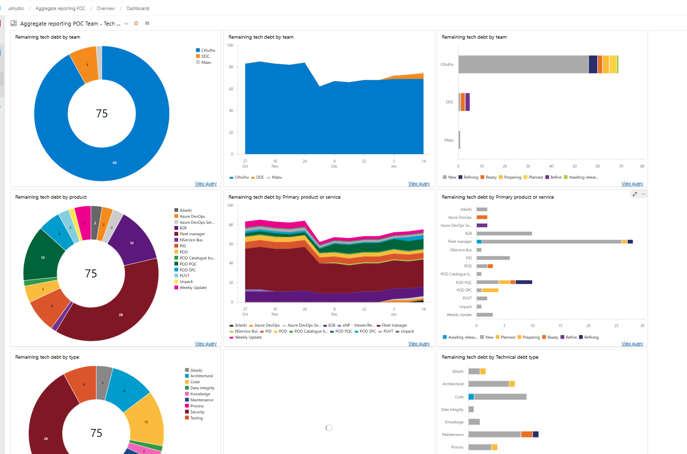
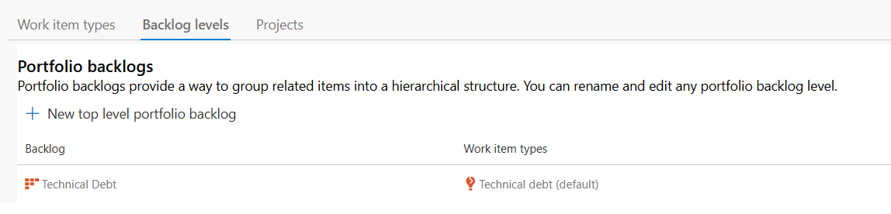

# Technical Debt Monitoring

## Pre-requisites

- Each project will need a `Technical Debt` work item type in their process.
    - This has to be added by a process editor.
    - if you are using the default **DGf** template then the project will have a Technical Debt type already.
- Each project will need a "Technical Debt" dash board.
- An aggregation of all the "Technical Debt" will be visible on a central dashboard.

## Work item fields

- A **Technical Debt** work item type **MUST** be created in target project. 
  - Add new Details section with the following fields (use existing field, do not create a  new field):
    - Primary Product or Service
      - there may be several interconnecting products but which is the main one, if needed, create a separate TD item for each product if they would be addressed separately.
    - Technical priority
      - TD1 - High business/technical value, high risk debt that needs to be paid off ASAP  (a Security tag should automatically be considered for a TD1 prioritisation).
      - TD2 - High business/technical value (cost reduction, blocker removing,  maintainability improvement), lower risk, a change that should be worked on when   time/opportunity permits and is not something that can be accepted or supported long  term.
      - TD3 - Tech debt that has been accepted as a risk but through paying off would add   value through improving usability, maintainability, reliability or performance.
      - TD4 - Accepted risk from the business, safe to leave until service reaches end of   life. Worth tracking in case developers are working in the area and can complete as   quick wins.
    - Technical Debt type
      - Architectural – Tightly coupled systems (lots of criss-crossed dependencies),       - restrictive to extension or automation
      - Code – Low quality code or ineffective patterns
      - Knowledge – lack of documentation or inaccessible documentation
      - Automation – Lack of automated tasks forcing manual intervention (Testing, deployments,       - backup/restore)
      - Testing – Unknown or unrecorded test scenarios, lack of test coverage
      - Maintenance – Out-of-support products, usually leading to security vulnerabilities
      - Process - inefficient or wasteful process steps, this could be related to practice or       - tooling
      - Security - Known and exploitable vulnerabilities
    - Technical Debt impact
      - Increased time to deliver
      - Unplanned work
      - Inaccurate planning
      - Disengaged Development teams
      - Longer times to recover
      - Instability
      - Security Concerns
  - Add a new section called Status
    - Add field for Scheduled Release

## Using `Technical Debt` work items

Once created the work item can be added to the team boards as part of the process backlog level, to allow tracking at the "Requirements backlog" level or as a separate backlog level, similar to features and epics.

The Technical Debt portfolio backlog will need to be added to each team view as needed.

