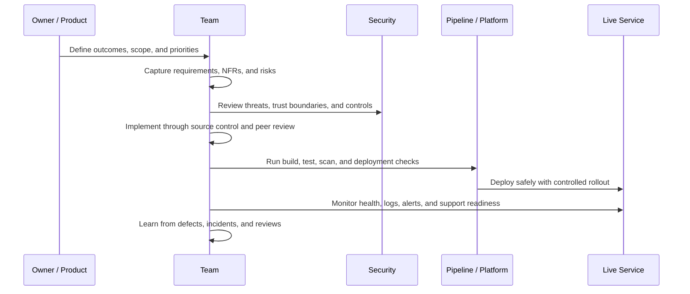

# Software Development Team Overview

## Purpose

This document provides a practical overview of how a software development team should operate when working in line with the current UKHO software engineering policy set, together with the draft policy additions identified in the gap analysis.

It is intended to describe **how a team should work day to day**, not replace the detailed policy documents.

## What good looks like

A software development team should:

- build and change services through a secure, repeatable engineering process
- work with clear ownership and accountable decision making
- design security, resilience, operability, and supportability into services from the start
- use source control, peer review, testing, and pipelines as standard delivery controls
- produce the evidence needed to show that controls were applied
- operate services responsibly after release and improve from incidents, defects, and audit findings

## Core team expectations

Every team should have, or clearly identify access to, the following responsibilities:

- **Product or service owner**
  - accountable for service outcomes and prioritisation
- **Technical lead**
  - accountable for technical direction, engineering standards, and delivery quality
- **Engineers**
  - design, build, test, review, and support the service
- **Security champion**
  - promotes secure development practices and supports threat modelling and control adoption
- **Risk owner**
  - accepts justified residual risk where policy or control exceptions are needed

Teams should also know who supports them for:

- platform and cloud engineering
- observability and logging
- security review and assurance
- incident coordination and operational escalation

## Team operating model

## How the team should work across the delivery lifecycle

## 1. Start with clear ownership and requirements

Before building or changing a service, the team should understand:

- what the service is for
- who owns it
- which user and operational flows matter most
- what security, resilience, performance, and support expectations apply
- what data the service handles and how sensitive it is

In practice, this means the team should maintain:

- a clear service owner and technical owner
- functional requirements and non-functional requirements
- security requirements appropriate to the service risk
- an understanding of dependencies, external integrations, and operational constraints

Relevant policy areas:

- `software-engineering-policies/NFRs/NFRPolicy.md`
- `software-engineering-policies/SystemDocumentation/SystemDocumentationPolicy.md`
- `software-engineering-policies/SecureDevelopment/SecureDevelopmentPolicy.md`
- `working/new/SecureByDesignDeliveryPolicy.md`

## 2. Design before implementation

The team should not move straight from an idea to coding. Important changes should be designed deliberately.

Design activity should cover:

- architecture and major components
- trust boundaries and data flows
- authentication and authorisation approach
- use of cloud services and shared platforms
- failure modes, resilience, and recovery approach
- monitoring and support model
- significant risks and mitigations

For higher-risk services, this should include proportionate threat modelling and formal security review.

Relevant policy areas:

- `software-engineering-policies/development-principles.md`
- `software-engineering-policies/SecureDevelopment/SecureDevelopmentPolicy.md`
- `software-engineering-policies/TechnologyGovernance/TechnologyGovernance.md`
- `working/new/SecureArchitectureAndDesignPrinciplesStandard.md`
- `working/new/NetworkAndServiceSecurityPolicy.md`

## 3. Build through controlled engineering practice

Teams should develop software through standard engineering controls, not informal or manual practices.

This means:

- all delivery code is stored in approved source control
- changes are made through branches and pull requests
- peer review is mandatory
- secrets are not stored in source code
- packages and dependencies are controlled and scanned
- infrastructure and pipeline changes are versioned and reviewed in the same way as application code

A healthy team also keeps its engineering practices sustainable by making changes small, understandable, and reversible.

Relevant policy areas:

- `software-engineering-policies/SourceControl/SourceControlPolicy.md`
- `software-engineering-policies/SourceControl/GitBranchProtectionPolicy.md`
- `software-engineering-policies/SourceControl/AzDoBranchProtection.md`
- `software-engineering-policies/CodeReview/CodeReviewPolicy.md`
- `software-engineering-policies/OpenSourceUse/OpenSourceUsePolicy.md`
- `software-engineering-policies/PackageAdoption/PackageAdoptionPolicy.md`
- `working/new/EngineeringCryptographyAndSecretsUsageStandard.md`

## 4. Test continuously, including security

Testing is not just a final step before release. The team should test throughout development.

A well-run team should use:

- unit tests
- integration and service-level tests where appropriate
- automated pipeline validation
- dependency and vulnerability scanning
- static analysis
- secret scanning
- infrastructure and container scanning where relevant
- targeted security testing for higher-risk services

The team should also control test data properly and avoid unnecessary use of production data in non-production environments.

Relevant policy areas:

- `software-engineering-policies/UnitTesting/UnitTestingPolicy.md`
- `software-engineering-policies/Pipelines/Baseline_Policy.md`
- `software-engineering-policies/SecureDevelopment/SecureDevelopmentPolicy.md`
- `working/new/SecurityTestingPolicy.md`
- `working/new/TestDataManagementPolicy.md`

## 5. Release safely and predictably

A software development team should release through a controlled deployment process.

Good release practice includes:

- automated builds and deployments wherever practical
- small, low-risk changes preferred over large batch releases
- pre-release checks and approval points proportionate to risk
- rollback or recovery plans for production changes
- progressive rollout where supported
- live health checks during deployment
- emergency change paths that remain attributable and reviewable

Relevant policy areas:

- `software-engineering-policies/Pipelines/Baseline_Policy.md`
- `software-engineering-policies/CodeReview/CodeReviewPolicy.md`
- `working/new/SecureByDesignDeliveryPolicy.md`
- `working/new/EngineeringChangeManagementPolicy.md`

## 6. Operate services as an engineering responsibility

The team’s responsibility does not end at deployment. Teams should be able to support and improve what they run.

That includes:

- structured logging
- meaningful telemetry and dashboards
- actionable alerts with named ownership
- runbooks for common failure and recovery scenarios
- documented backup and restore expectations where needed
- support contacts and escalation routes
- understanding of incidents, defects, and operational risks

Relevant policy areas:

- `software-engineering-policies/Logging/LoggingPolicy.md`
- `software-engineering-policies/Observability/observability_policy.md`
- `software-engineering-policies/CloudDevelopment/LoggingAndMonitoring.md`
- `software-engineering-policies/CloudDevelopment/DisasterRecoveryBusinessContinuity.md`
- `working/new/ObservabilityAndMonitoringPolicy.md`
- `working/new/BackupAndRestoreAssurancePolicy.md`
- `working/new/EngineeringIncidentReadinessAndLessonsLearnedPolicy.md`

## 7. Control access and protect environments

A well-run team treats identity and access as an active engineering control.

The team should:

- grant access on a least-privilege basis
- avoid shared accounts for routine activity
- use strong authentication and privileged access controls
- review access regularly
- prefer managed identities or platform identities over stored credentials
- control access to repositories, pipelines, package feeds, environments, and support tooling consistently

Relevant policy areas:

- `software-engineering-policies/SourceControl/SourceControlPolicy.md`
- `software-engineering-policies/CloudDevelopment/General.md`
- `software-engineering-policies/CloudDevelopment/Users.md`
- `working/new/EngineeringIdentityAndAccessManagementPolicy.md`

## 8. Manage data responsibly

Engineering teams should handle service data, logs, test data, temporary files, and artefacts in a controlled way.

This includes:

- minimising sensitive data use
- masking or anonymising test data where needed
- avoiding sensitive data in logs
- defining retention periods for operational and engineering data
- deleting temporary or obsolete data safely
- protecting backups, artefacts, and exported datasets

Relevant policy areas:

- `software-engineering-policies/CloudDevelopment/DataUse.md`
- `software-engineering-policies/Logging/LoggingPolicy.md`
- `working/new/TestDataManagementPolicy.md`
- `working/new/EngineeringDataRetentionAndDeletionPolicy.md`

## 9. Keep evidence as part of normal delivery

A mature software team should not treat audit evidence as a separate activity at the end of a project.

Instead, evidence should be produced naturally through the way the team works.

Typical evidence includes:

- requirements and design records
- threat models or risk assessments
- pull requests and review history
- build, test, and scan outputs
- deployment records
- runbooks and dashboards
- access review records
- incident reviews and lessons learned
- exception and risk acceptance records

Relevant policy areas:

- `software-engineering-policies/SystemDocumentation/SystemDocumentationPolicy.md`
- `working/new/EngineeringAssuranceEvidenceChecklist.md`
- `working/new/EngineeringPolicyComplianceChecklist.md`

## 10. Improve continuously

A strong team uses feedback loops to improve both the service and the way it works.

Improvement inputs should include:

- defects and escaped issues
- security findings
- incident reviews
- audit findings
- operational pain points
- dependency and platform changes
- recurring manual work that should be automated

This means the team should regularly:

- remove technical debt where it creates risk or delivery friction
- improve test coverage and deployment safety
- improve monitoring and support documentation
- review whether policies are actually being followed in practice

## Summary view

A software development team working in line with the UKHO policy set should operate as a **secure, evidence-driven, service-owning engineering team**.

In simple terms, the team should:

1. understand what it is building and who owns the risk
2. design changes before implementing them
3. develop through source control, peer review, and automation
4. test continuously, including security controls
5. release safely through controlled pipelines
6. operate and support services after release
7. control access and protect data throughout the lifecycle
8. retain enough evidence to demonstrate compliance and good engineering practice
9. learn continuously from delivery and operational experience

## Recommended use of this document

This document can be used as:

- an onboarding overview for new engineering teams
- a management summary of how teams are expected to work
- a bridge between detailed policy documents and day-to-day engineering practice
- a reference document to support future consolidation of the engineering policy set
